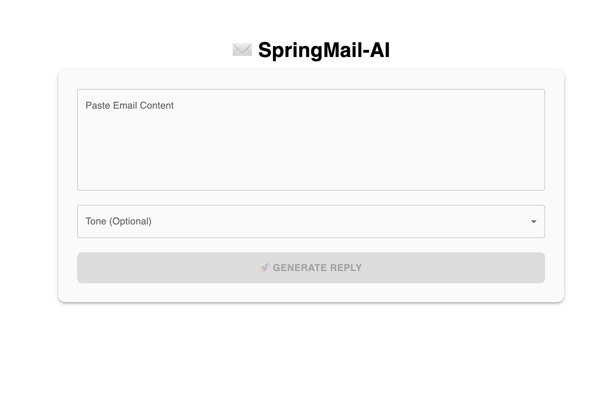
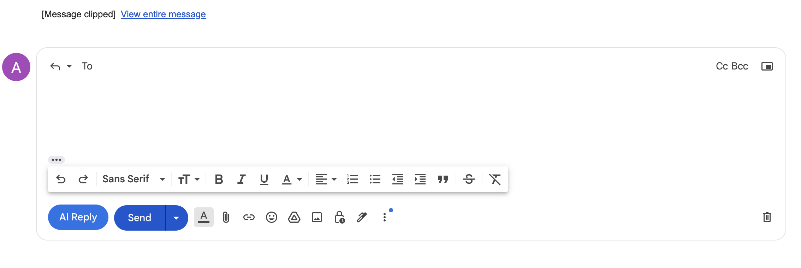

### 📧 **SpringMail-AI: Smart Email Assistant**
An **AI-powered Email Reply Generator** built using **Spring Boot, Spring AI, and React**, with a **Gmail extension** for seamless email automation.  

---

## 📌 **Features**
✅ AI-powered email reply generation  
✅ Supports multiple tones (Professional, Friendly, Casual)  
✅ Interactive **React-based frontend**  
✅ Gmail extension for direct AI replies  
✅ **Spring Boot + Spring AI backend** for fast processing  
✅ Copy-to-clipboard functionality  

---

## 🛠️ **Tech Stack**
**Frontend:** React, Material UI  
**Backend:** Spring Boot, Spring AI, OpenAI API   
**Extension:** JavaScript, Manifest V3  

---

## 🚀 **Getting Started**
### **1️⃣ Clone the Repository**
```bash
git clone https://github.com/yourusername/Springmail-AI.git
cd springMail-AI
```

### **2️⃣ Backend Setup (Spring Boot)**
- Navigate to backend folder:
  ```bash
  cd springmail-ai
  ```
- Install dependencies:
  ```bash
  mvn clean install
  ```
- Set up environment variables for API keys in `.env` .  
- Start the backend:
  ```bash
  mvn spring-boot:run
  ```
  
### **3️⃣ Frontend Setup (React)**
- Navigate to frontend folder:
  ```bash
  cd springmail-ai-react
  ```
- Install dependencies:
  ```bash
  npm install
  ```
- Start React app:
  ```bash
  npm start
  ```

### **4️⃣ Gmail Extension Setup**
- Navigate to `chrome://extensions/`  
- Enable **Developer Mode**  
- Click **"Load Unpacked"**, select the `springmail-ai-extension` folder  

---

## 📸 **Screenshots**
### 🔹 Web Interface  


### 🔹 Gmail Extension  


---

## 📜 **API Endpoints**
| Method | Endpoint | Description |
|---------|------------|----------------|
| **POST** | `/api/email/generate` | Generates AI email reply |

---


### **✨ Show Your Support**
⭐ Star this repo if you like it!  
💬 Reach out for collaborations!  
